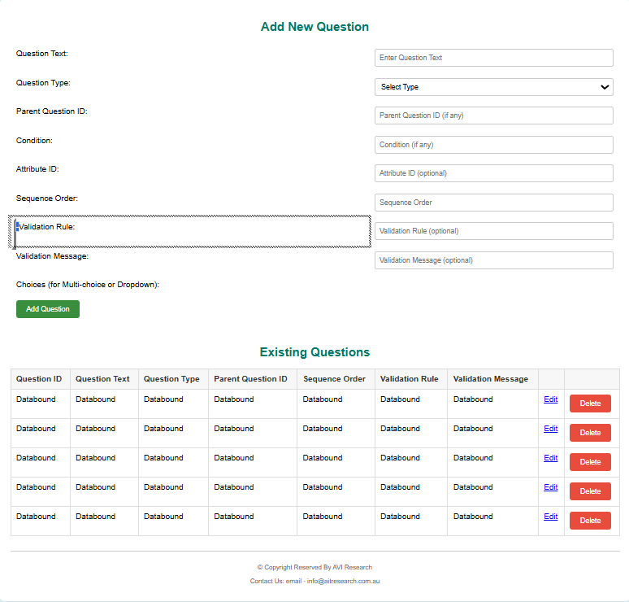

# Survey System


(Screenshot 2025-08-22 142558.png)
(Screenshot 2025-08-22 142527.png)
(Screenshot 2025-08-22 142500.png)
(Screenshot 2025-08-22 142625.png)
(Screenshot 2025-08-22 142655.png)
(Screenshot 2025-08-22 142719.png)
(Screenshot 2025-08-22 142743.png)

## Overview
This is a dynamic **Survey System** built with ASP.NET and SQL Server.  
It supports conditional branching, respondent management, and staff search filters.

## Features
- Add, edit, delete, and order survey questions.  
- Conditional branching for child questions.  
- Store answers in `Answers` and respondent attributes in `RespondentAttributes`.  
- Dynamic Staff Search filters (gender, age, state, service type, insurance).  
- Secure login for staff and respondents.  

## Tech Stack
- **Frontend**: ASP.NET WebForms  
- **Backend**: C# (`Survey.aspx.cs`, `StaffSearch.aspx.cs`)  
- **Database**: SQL Server (Surveys, Questions, Options, Respondents, Answers)  

## Setup
1. Clone this repo:
   ```bash
   git clone 
